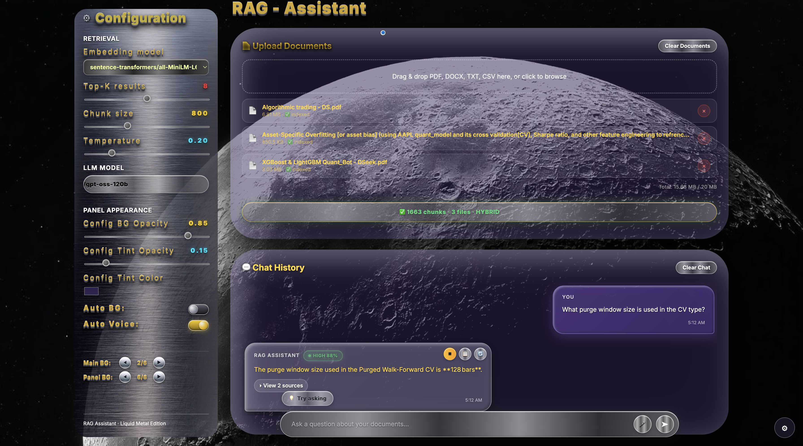
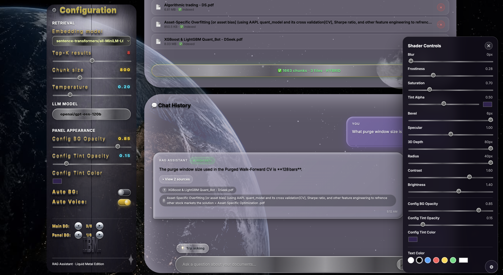
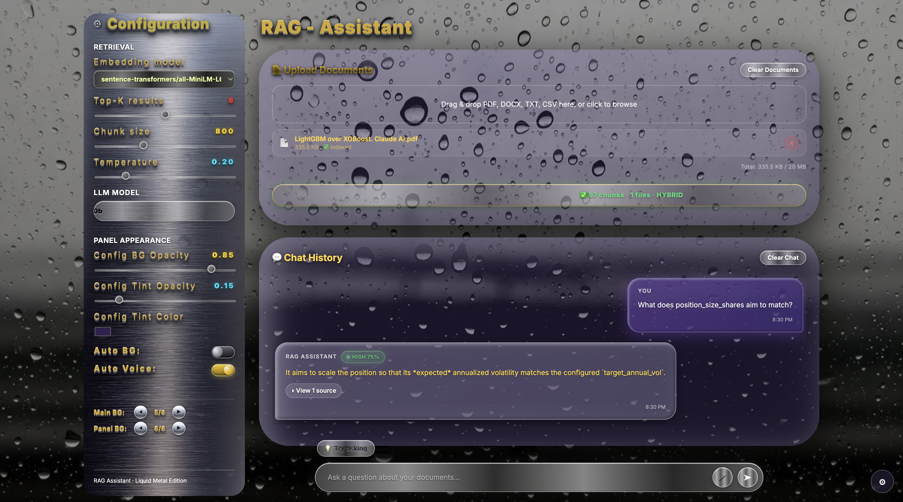
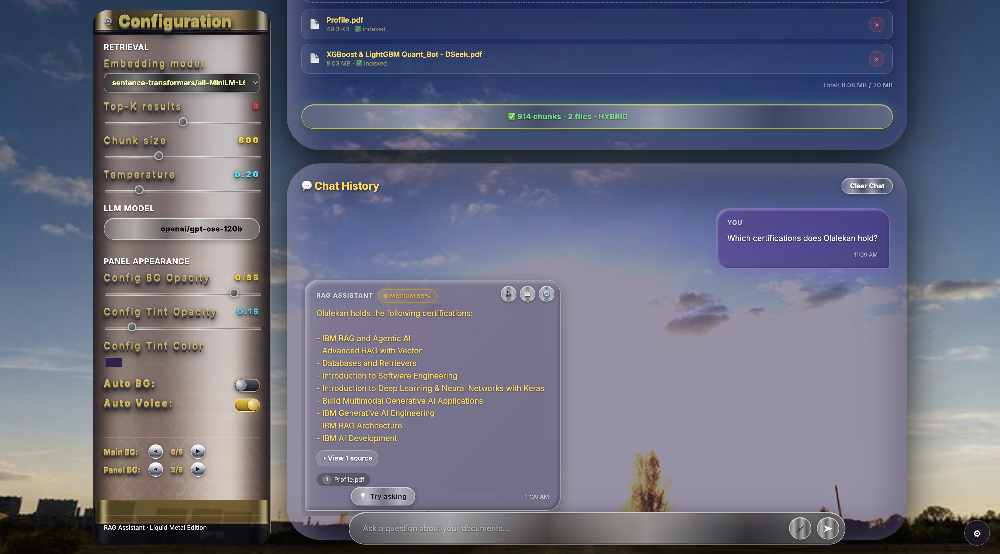

# 🎨 Metal Liquid Dashboard — RAG Assistant

> A Flask-based Retrieval-Augmented Generation assistant with a **Liquid Metal UI**, hybrid retrieval, streaming answers, live shader controls, and voice I/O — running entirely on free-tier services.

[](https://metal-liquid-dashboard-rag-assistant.onrender.com)
[](https://www.python.org/)
[](https://flask.palletsprojects.com/)
[](https://www.docker.com/)

---

## 📸 Screenshots

### Full Dashboard — Hybrid Retrieval in Action


*Upload multiple PDFs, ask natural-language questions, get sourced answers with confidence scoring.*

### Live Shader Controls + Multi-Source Attribution


*Tune blur, frostiness, tint, saturation, and text color in real time. Each answer cites its sources with a confidence badge.*

### Confidence Scoring + Voice Input


*Every answer is scored HIGH / MEDIUM / LOW based on retrieval strength. The mic button transcribes your question live.*

### Config Panel — Toggles, Model Selector & Background Controls


*Auto BG and Auto Voice toggles, LLM model selector, background navigation, and retrieval hyperparameters.*

---

## ✨ Features

### Retrieval
- **Hybrid search** — FAISS (semantic) + BM25 (keyword) fused via Reciprocal Rank Fusion
- **Smart source filtering** — IDF-weighted gap-ratio cutoff picks only the relevant sources
- **Incremental indexing** — upload new files, they auto-index and append to the existing knowledge base
- **Per-file removal** — remove a document, its chunks vanish from both FAISS and BM25

### Chat
- **Streaming answers** with a smooth typewriter effect
- **Confidence badges** — HIGH / MEDIUM / LOW % scores derived from retrieval strength
- **Source attribution** — click "View N sources" to expand the exact files used
- **Copy + Regenerate** buttons on every AI response
- **Suggested questions** — LLM-generated starter prompts based on your uploaded content

### Voice
- **Voice input** — Web Speech API for live speech-to-text; the mic button only appears in supporting browsers
- **Auto Voice** — reads every answer aloud with an auto-picked female voice; toggleable in the config panel
- **Manual speaker button** — replay any answer on demand
- **Markdown-aware** — strips bold markers, code fences, and headings before speaking

### UI
- **Liquid Metal aesthetic** — chrome gradients, glassmorphism, multi-layer backdrop blur
- **Live shader panel** — 10 sliders for blur, frostiness, saturation, bevel, specular, depth, radius, contrast, brightness, and text color
- **Dynamic backgrounds** — 6 main BG images + 6 config panel BG images with cinematic crossfades
- **Auto BG toggle** — cycles backgrounds every 30s (panel) / 35s (main); manual nav buttons always work
- **Text color picker** — drives AI responses, file names, chat titles; question bubbles stay white by design

---

## 🏗️ Architecture

```
User uploads PDF/DOCX/TXT/CSV
         │
         ▼
┌─────────────────────────────┐
│  Text extraction            │  ← pypdf, python-docx, csv
│  Recursive character split  │  ← chunk_size=800, overlap=200
└──────────────┬──────────────┘
               │
       ┌───────┴────────┐
       ▼                ▼
   ┌────────┐      ┌──────────┐
   │ FAISS  │      │  BM25    │
   │ (dense)│      │ (sparse) │
   └────┬───┘      └────┬─────┘
        │               │
        └──────┬────────┘
               ▼
      Reciprocal Rank Fusion
               │
               ▼
   IDF-weighted source filter
               │
               ▼
      Top-K context chunks
               │
               ▼
      Groq LLM (gpt-oss-120b)
               │
               ▼
      Streaming answer + sources + confidence
```

**Backend:** Flask · LangChain · FAISS · rank_bm25
**LLM:** Groq API (openai/gpt-oss-120b, gpt-oss-20b, qwen/qwen3.8-27b)
**Embeddings:** HuggingFace Inference API (sentence-transformers/all-MiniLM-L6-v2)
**Frontend:** Vanilla JS + Web Speech API · single-page HTML with no build step
**Deployment:** Docker → Render

---

## 🚀 Local Setup

```bash
# 1. Clone
git clone https://github.com/olalekanijagbemi-VR/Metal_Liquid_Dashboard-Rag_Assistant.git
cd Metal_Liquid_Dashboard-Rag_Assistant

# 2. Create virtualenv
python3 -m venv venv
source venv/bin/activate

# 3. Install dependencies
pip install -r requirements.txt

# 4. Add your API keys
cat > .env << 'EOF'
GROQ_API_KEY=gsk_your_key_here
HF_API_TOKEN=hf_your_token_here
EOF

# 5. Run
python app.py
```

Open **http://127.0.0.1:5002**

### Required API keys

| Service | Free tier | Get it |
|---|---|---|
| **Groq** | Yes — generous free tier | https://console.groq.com/keys |
| **HuggingFace** | Yes — free Inference API | https://huggingface.co/settings/tokens (Read scope) |

---

## ☁️ Deployment (Render)

This repo ships with a `Dockerfile` — Render auto-detects it as Docker runtime.

1. Push to GitHub
2. Render → New + → Web Service → connect repo
3. Settings:
   - **Runtime:** Docker (auto-detected)
   - **Instance Type:** Free
   - **Environment Variables:** GROQ_API_KEY, HF_API_TOKEN
4. Deploy

**Free tier caveats:**
- App sleeps after 15 min inactivity → ~50s cold start on first request
- Ephemeral filesystem — uploaded docs + FAISS index reset on redeploy

---

## 🎯 Roadmap

- [ ] Source preview on click — show the actual chunk text the LLM saw
- [ ] Multi-document scoping — filter search to selected files
- [ ] Citation highlighting — inline [1], [2] markers mapped to sources
- [ ] Persistent storage — S3 or Supabase for uploads + index
- [ ] Streaming TTS — read answers sentence-by-sentence as they arrive

---

## 📁 Project Structure

```
Metal_Liquid_Dashboard-Rag_Assistant/
├── app.py                      # Flask backend
├── source_attribution.py       # IDF-weighted source filtering
├── requirements.txt
├── Dockerfile
├── README.md
└── static/
    ├── rag_dashboard.html      # Entire frontend (single-page, no build)
    ├── bg/                     # 12 background images
    └── screenshots/            # README assets
```

---

## 📄 License

MIT — see [LICENSE](LICENSE) for details.

---

## 🙌 Credits

Built by **Olalekan Ijagbemi** — [GitHub](https://github.com/olalekanijagbemi-VR) · [LinkedIn](https://linkedin.com/in/olalekan-ijagbemi-95a1b2269)

Third live deployment in the ML portfolio series:
1. [Mushroom ML Classifier](https://ml-with-liquid-glass-dashboard.onrender.com)
2. [Universal CSV Analyzer](https://universal-csv-analyzer.onrender.com)
3. **RAG Assistant** ← this repo